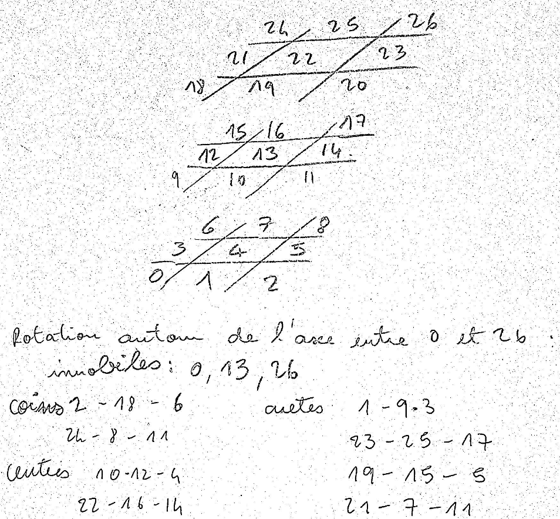

A program for counting the possible combinations that solve the Soma cube



S3 permutation:  
```
x = (x & 0xfebaa0a1)
  | ((x & 0x00000400) << 2)
  | ((x & 0x00000100) << 3)
  | ((x & 0x00000010) << 6)
  | ((x & 0x00004002) << 8)
  | ((x & 0x00000800) << 13)
  | rol(x & 0x01000004, 16)
  | ((x & 0x00040000) >> 12)
  | ((x & 0x00001000) >> 8)
  | ((x & 0x00400200) >> 6)
  | ((x & 0x00000040) >> 4)
  | ((x & 0x00010008) >> 2);
```

Link to [code generator for a bitwise permutation](https://programming.sirrida.de/calcperm.php)  
Link to [bitwise rotation in Python](https://www.falatic.com/index.php/108/python-and-bitwise-rotation)


